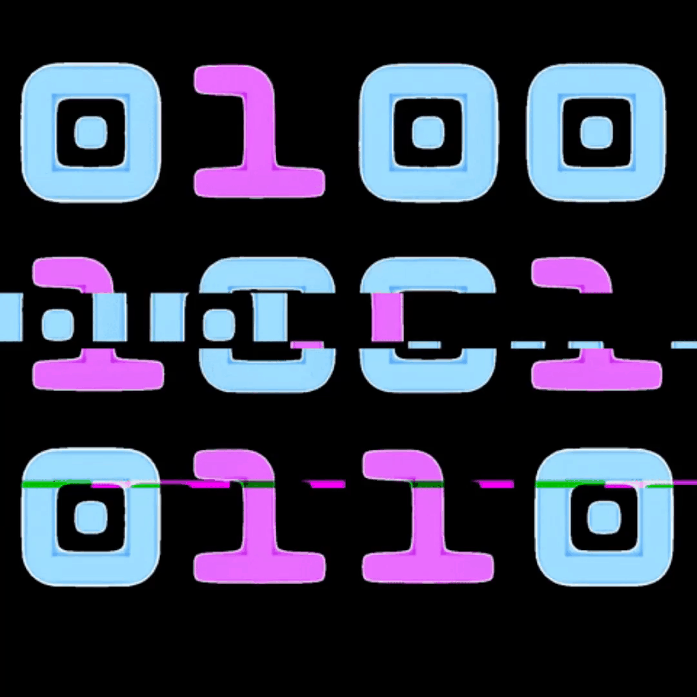

<h1 align="center"></h1>
<h2 align="center">Hello World  <!--:octocat:--></h2>

<h3 align="center">Here one day on GitHub </h3>

<table align="right">
<tr>
<td>

<!-- [][youtube]-->
<!-- [][twitter]-->

</td>
</tr>
</table>

  
 About me!

### 💻 Software Engineering Student !!
- 🦾 I love computer security!
- 🤓  I’m currently learning everything
- 👾  I am very curious and that is why you start studying programming
- 🗒  I am currently very obsessed with learning computer security and python

 

<!---

<h3 align="center"> Latest Projects</h3>

--->
---
<h3 align="center"> Languages & Tools & Skills</h3>

    
    
    
    
    
    
    
    
    

---

<h3 align="left"> GitHub Stats</h3>

 

